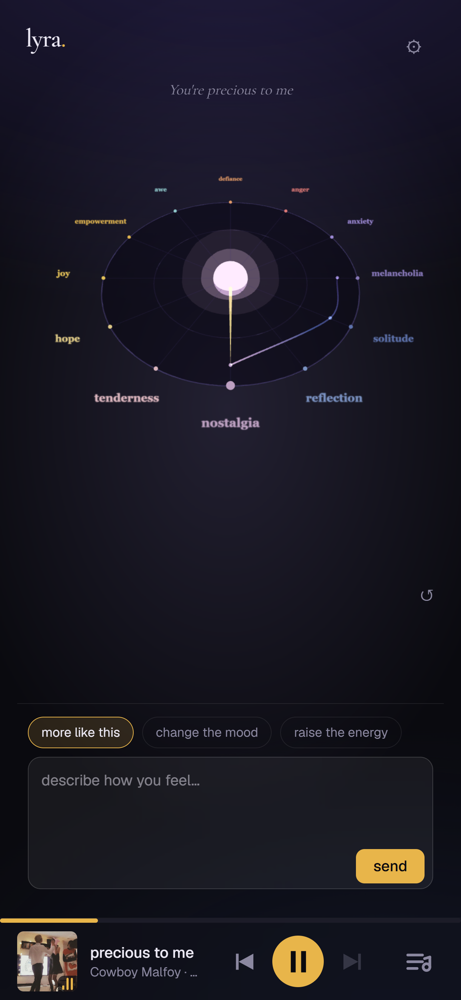

# lyra

**Tell lyra how you feel — it builds a playlist that travels your emotions, choosing songs by what their lyrics actually say.**

Most discovery matches the *surface* of music (genre, tempo, audio fingerprint). lyra matches **meaning**: it reads lyrics, places every track in an emotional space, meets you where you are, and walks you somewhere — citing the **line** that marks each passage.

<p align="center">
  
</p>

> **This repo is a focused MVP** — a self-contained *Discover* experience that proves the
> engine end-to-end on real Musixmatch data, scoped by the contest's no-persistence rules.
> The full product (lyra as a lyrics-intelligence layer a DSP plugs in, plus Learn/Memory,
> voice, variable journeys, reaction-learning) lives in the vision doc.
>
> 📄 [`SUBMISSION.md`](./SUBMISSION.md) — submission copy · [`docs/PITCH.md`](./docs/PITCH.md) — elevator pitch · [`docs/VISION.md`](./docs/VISION.md) — full product vision & roadmap · [`docs/HOW_IT_WORKS.md`](./docs/HOW_IT_WORKS.md) — technical walkthrough

## Table of contents

- [How it works](#how-it-works)
- [Features](#features)
- [Demo](#demo)
- [Architecture](#architecture)
- [Tech stack](#tech-stack)
- [Run locally](#run-locally)
- [Deploy](#deploy)
- [Musixmatch compliance](#musixmatch-compliance)
- [Links](#links)
- [License](#license)

## How it works

1. **Say how you feel** — pick up to 3 emotions, or type it in plain language (*"restless but quietly hopeful"*). A Claude agent reads the text into the same 3-emotion state.
2. **lyra plots a journey** — not a flat list but a *trajectory*: an entry track, then songs that move through the emotional space toward where you're heading.
3. **Steer live** — *more like this / change the mood / raise the energy* reshape the upcoming queue without interrupting the current track.
4. **See it** — a 3D **emotional compass** (12-emotion wheel) turns to your dominant feeling and traces the path the playlist takes.

## Features

- **Mood in, music out** — pick emotions on the wheel or describe a feeling in natural language.
- **A journey, not a list** — playlists follow an emotional *trajectory* with an arc.
- **Live steering** — reshape the path mid-listen (deepen / evolve / escalate) without cutting the current track.
- **3D emotional compass** — a 12-emotion wheel that turns to your mood and draws the path travelled.
- **Lyrics-grounded** — songs chosen by what they *say*; surfaces the cited line (Musixmatch richsync).
- **Mobile-first + desktop** — compass-first portrait layout and a desktop split view.
- **Never dies** — mock fallback on every endpoint, so the demo always runs.

## Demo

- **Demo video:** _TBD_
<!-- Once the backend deploy is wired, add:  **App:** https://lyra-green-chi.vercel.app -->


## Architecture

Folder monorepo — boundaries keep the two workstreams conflict-free.

```
shared/     Engine ⇄ agent contract — the cross-team source of truth
  schema.py        Pydantic models (MacroNode, Distribution, Trajectory…)
web/        Next.js frontend + 3D compass + API proxy — Alberto
  src/components/   SplitView, CompassScene (react-three-fiber), …
  src/app/api/      proxy to the backend; mock fallback so the demo never dies
  src/lib/types.ts  TS mirror of the contract (same snake_case names)
backend/    FastAPI service — exposes the engine + agent over HTTP — Axel
  app.py           routes: /entry /journey /refill /turn /recommend /health
  agent.py         language layer (datapizza-ai + Claude): interpret + narrate
  engine_bridge.py wires the real engine in (replaces the old mock_engine)
engine/     The trajectory engine — Axel
  taxonomy.py      12 macro-nodes + cached name embeddings (all-mpnet-base-v2)
  softmap.py       Musixmatch mood/theme → distribution over the 12 nodes
  trajectory.py    walks the emotional space, picks the nearest track per step
  data/            cached node embeddings + seed catalog
```

<!-- Axel: please sanity-check the backend/ + engine/ descriptions above for accuracy. -->

## Tech stack

- **Musixmatch Pro API** — lyrics, richsync (the cited verse), `analysis.search` over the catalog.
- **Engine** (Python) — `sentence-transformers/all-mpnet-base-v2` embeddings map tracks onto a 12-node emotion taxonomy (a valence × energy circumplex); trajectories are walks across that space.
- **Agent** — Claude (`claude-sonnet-4-6`, via datapizza-ai): reads free-text mood into ≤3 weighted nodes + journey shape, and narrates each step.
- **Frontend** — Next.js + `react-three-fiber` (3D compass); mobile compass-first + desktop split view. 30s previews via Deezer/iTunes (Musixmatch is lyrics, not audio).

## Run locally

### Frontend

```bash
cd web
npm install
npm run dev          # http://localhost:3000
```

Runs on its own with **no key**: audio is real (iTunes/Deezer previews), the trajectory falls back to mock when the backend is down — the demo never dies.

### Backend (real engine + agent)

Python env via **uv** (Python pinned to 3.12; datapizza-ai needs `>=3.10,<3.13`).

```bash
cd backend
uv sync                                       # Python 3.12 + locked deps (incl. torch)
uv run uvicorn app:app --reload --port 8010   # first run downloads the model (~once)
```

Keys live in `engine/.env` (git-ignored) — the engine loads them itself:

```
MUSIXMATCH_API_KEY=…
ANTHROPIC_API_KEY=…
```

Then point the frontend at it: `BACKEND_URL=http://localhost:8010` in `web/.env.local`.

## Deploy

Frontend and backend deploy **separately**, each where it fits best:

- **Frontend → Vercel** (native Next.js). Set env `BACKEND_URL` to the backend's public URL, then deploy.
- **Backend → Replit Reserved VM** (always-on). It loads an ML model (~542 MB) and needs a warm process, so use a **Reserved VM with ≥2 GB RAM — not Autoscale** (scale-to-zero would re-download/re-load the model on every cold start). Config: [`.replit`](./.replit).
  - Secrets (Replit → Secrets): `MUSIXMATCH_API_KEY`, `ANTHROPIC_API_KEY`.
  - Run: `cd backend && uvicorn app:app --host 0.0.0.0 --port $PORT`.

Both Vercel and Replit are Musicathon partners.

## Musixmatch compliance

No Musixmatch content is persisted: lyrics / richsync / analysis are fetched **real-time per session** and not stored. Only our own artifacts (the macro-node name embeddings) are cached. Audio is **not** Musixmatch content (iTunes/Deezer), so it sits outside the constraint.

## Links

- **Submission copy:** [`SUBMISSION.md`](./SUBMISSION.md)
- **Elevator pitch:** [`docs/PITCH.md`](./docs/PITCH.md)
- **Product vision & roadmap:** [`docs/VISION.md`](./docs/VISION.md)
- **How it works (technical):** [`docs/HOW_IT_WORKS.md`](./docs/HOW_IT_WORKS.md)
- **Repo:** https://github.com/dr-zaib/Lyra_musicathon
- **Issues:** https://github.com/dr-zaib/Lyra_musicathon/issues
- **Demo video:** _TBD_

## License

_TBD — built for the **Musixmatch Musicathon 2026**. Add a `LICENSE` file before open-sourcing._
