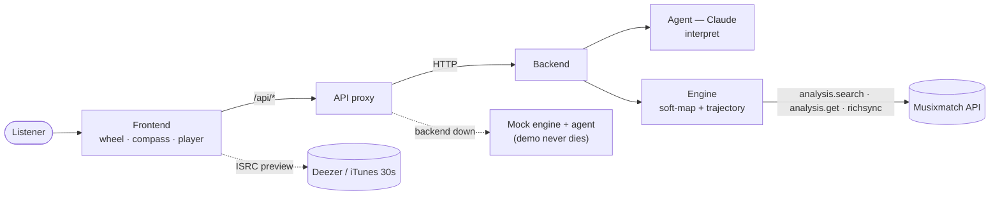
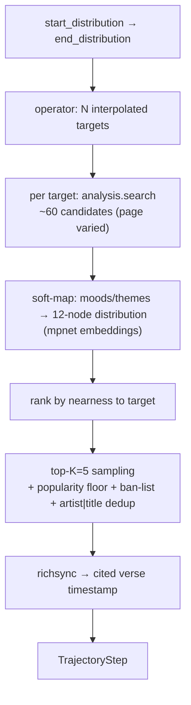
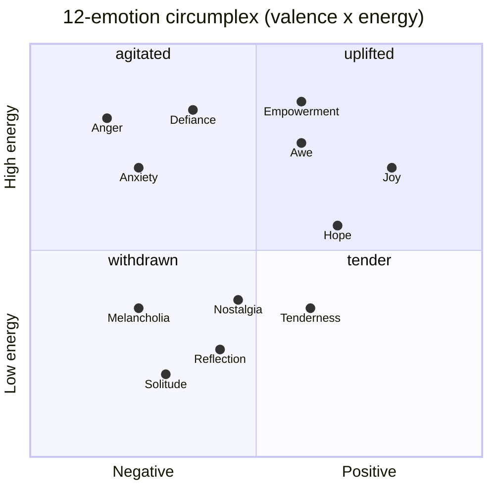
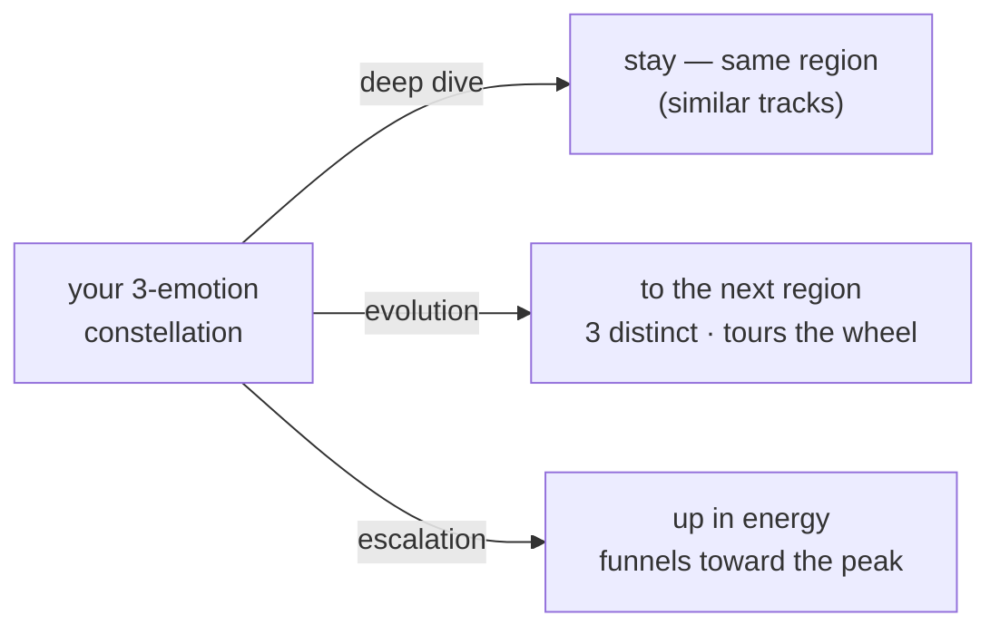

# How lyra works (the MVP — engine + agent)

> Technical walkthrough of **this repo: the hackathon MVP/demo**. It describes what is
> actually built and running. The full envisioned product (host-DSP integration, persistent
> semantic layer, voice, Learn/Memory, etc.) lives in [`VISION.md`](./VISION.md).

The listener expresses a feeling — in words or by touching the wheel — and lyra builds an
**emotional journey** of songs pulled *by meaning* from the Musixmatch catalog, citing the
**line** that marks each passage.

---

## 1. Prepared once (offline — our own artifacts)
- **Taxonomy + node embeddings** (`engine/taxonomy.py` + `data/node_embeddings.npz`): the 12
  emotional macro-nodes (a valence × energy circumplex), each vectorized once with
  **`sentence-transformers/all-mpnet-base-v2`**. This is the only persisted *content* — it's ours.
- **Seed** (`engine/data/seed_enriched.json`, 303 tracks from Spotify playlists, 100% ISRC,
  enriched with Musixmatch `commontrack_id`s): the user's **go-to** pool. In the demo it stands
  in for the host DSP's user profile; it feeds the "known" half of recommendations and the
  `shuffle` serendipity path.

## 2. The HTTP seams



`web` → `backend` → engine + Musixmatch. Each `web/src/app/api/*` route
proxies the backend and **falls back to a local mock** (`mockAgent`/`mockEngine`) if it's
unreachable, so the demo never dies. Endpoints (`backend/app.py`):

| Endpoint | In → Out | Role |
|---|---|---|
| `POST /entry` | mood → `EntryResponse` | skippable list of N entry candidates (known/new mix) → first audio starts instantly |
| `POST /journey` | `shape` + `seed_distribution` + `end_distribution` → `Trajectory` | the playlist for a chosen steer |
| `POST /refill` | remaining queue → `[TrackCandidate]` | tops the queue up (centroid of what's left) |
| `POST /turn` | `{message}` → `AgentTurn` | one-shot conversational seam (interpret + build) |
| `POST /recommend` | `{seed_mood, shape}` → `Trajectory` | legacy click-a-node |
| `GET /health` | → `{ok}` | liveness |

## 3. The live flow (in memory — no Musixmatch content persisted)

```mermaid
sequenceDiagram
    actor U as Listener
    participant FE as Frontend
    participant AG as Agent
    participant EN as Engine
    participant MX as Musixmatch
    U->>FE: type a mood / tap 3 emotions
    FE->>AG: interpret(text)
    AG-->>FE: distribution (≤3 nodes) + shuffle + shape
    Note over AG: message stays empty — recsys, not chatbot
    FE->>EN: POST /entry
    EN->>MX: analysis.search
    MX-->>EN: candidates
    EN-->>FE: entry candidates → play candidate[0] now
    U->>FE: choose a steer (deepen / evolve / escalate)
    FE->>EN: POST /journey (seed_distribution to end_distribution)
    EN->>MX: analysis.search + richsync (per step)
    EN-->>FE: trajectory — tracks + cited verses
    FE->>U: queue rebuilds; compass turns
```

**The split that matters:** the **engine** produces the structured `Trajectory` (deterministic);
the **agent** does *language only* (intent). **Narration is OFF in the MVP**
(`NARRATE_ENABLED = False` in `backend/agent.py`): `transition_reason` stays empty — lyra shows
the **raw cited verse**, not interpretive blurbs, and `/journey` is faster for it.

## 4. The engine internals
| Component | File | Role |
|---|---|---|
| Musixmatch client | `engine/musixmatch.py` | `analysis.search`, `analysis.get`, `richsync.get`, matcher (network-resilient) |
| Soft-map | `engine/softmap.py` | Musixmatch mood/theme label → distribution over the 12 nodes (mpnet + cache + batch `prewarm`) |
| Trajectory engine | `engine/trajectory.py` | operators + `build_trajectory` / `entry_candidates` / `refill_candidates` (parallelized) |
| Agent | `backend/agent.py` | `interpret` (Claude); `narrate` present but disabled |
| Contract | `shared/schema.py` ↔ `web/src/lib/types.ts` | identical field-for-field (snake_case) |

**`build_trajectory` per step:**



- **Trajectory operators** (`deepen` / `evolve` / `escalate`): a step sequence interpolating from
  `seed_distribution` (where you are) to `end_distribution` (the destination constellation) over the
  steps — so an evolve/escalate transition reads **gradual**. `/journey` uses **6 steps**, `/entry`/`/turn` use 4.
- **Selection = diversity, not argmin.** `find_next_track` samples among the **top-K=5** nearest
  candidates (weighted toward the closest) so repeated turns don't surface the same tracks;
  `_fetch_candidates` also **varies the `analysis.search` page (1–3)**. Popularity floor
  (`track_rating ≥ 20`), `has_richsync` preferred, **ban-list** (`user_prefs.json`) and **artist|title
  dedup** enforced at every tier.
- **known/new mix:** entry + journeys blend ~50/50 **known** (go-to seed) and **new** (taste-seeded
  `analysis.search`), with a **≥15% new floor** (no filter bubble); exposed as a settings slider.
- **`shuffle`:** the agent's neutral remainder; that fraction of a journey is drawn from go-to ∪
  new-but-similar discovery instead of the aimed targets.

## 5. The wheel / steering model (frontend)
- Emotions are a **FIFO buffer of the last 3 picks** (same mood twice = 2× weight; a 4th drops the
  oldest). Typing fills the same 3 slots via the agent. The wheel shape derives deterministically from the buffer.
- **Choosing a steer re-selects the constellation** (computed locally, instantly — mirrors the engine):
  **deep dive** keeps it (start = end → similar tracks); **evolution** moves each emotion to the nearest
  node in a **different region** (4 balanced regions of 3 — repeated, it tours the whole wheel);
  **escalation** moves each to the nearest node at **higher arousal**. The new constellation is sent as
  `end_distribution`; the upcoming queue rebuilds **without interrupting the current track**.
- **Two visualizations:** a **3D compass** (react-three-fiber, default) and a **2.5D radar wheel**
  (`?view=2d`), with a **WebGL fallback** to the 2.5D wheel. **Mobile-first** compass layout + desktop split view.

**The 12 emotions** live on a valence × energy circumplex (the taxonomy, at their real coordinates):



> The engine groups these into **4 balanced regions of 3** (by angle): *withdrawn* (Melancholia·Solitude·Reflection) · *warm* (Nostalgia·Tenderness·Hope) · *uplifted* (Joy·Awe·Empowerment) · *intense* (Defiance·Anger·Anxiety).

**What each steer does to the constellation:**



## 6. While you listen — audio + the cited verse
- Audio = **30s previews** resolved client-side **ISRC-first via Deezer** (`track/isrc:…`), text
  fallback (Deezer → iTunes); the `<audio>` is **unlocked on first gesture** so the entry track autoplays.
- The **cited verse** (from the analysis theme quotes, aligned to the target emotion) is shown above the player.
- **richsync** gives `timestamp_in_song` = when the cited line is sung in the *full* track.
  **Honest caveat:** the demo plays a 30s *window* (iTunes doesn't expose its offset), so the cited
  line usually isn't inside the clip → the verse is a **displayed highlight**, not a hard seek.
  With full DSP playback (roadmap) the full song + richsync align and word-by-word karaoke works —
  `timestamp_in_song` is exactly what that needs, so it's captured, not wasted.

## 7. Performance & resilience
- `/entry` ≈ 7s warm / 12s cold (matching go-to to the mood needs live analysis); `/journey` ≈ **6s**
  (no narration). Parallel `analysis.search`, batch embeddings, model pre-warmed at startup.
- Transient network/SSL errors retry/degrade; the frontend mock fallback keeps the UI alive.

## 8. Contest rules — respected
Only **identifiers** and **our own artifacts** (node embeddings) are persisted. Lyrics / richsync /
analysis are Musixmatch **content** → fetched real-time, kept in memory, never written to disk.
Audio is **not** Musixmatch content (Deezer/iTunes), so it sits outside the constraint.
